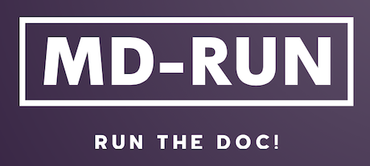

# :star: md-run :star: - Run MarkDown file



## Why md-run? :thinking:

Have you ever tired of testing every codeblocks in your MarkDown documentation ever and ever again? :sweat:

By using md-run, you no longer need to do that manually. :sunglasses:

## Install

```bash
npm install -g md-run
```

## Usage

```bash
$ md-run
Options:
  -s, --script   script name. eg: start, test,...    [string] [default: "start"]
  -u, --uri      uri pointed to markdown file                [string] [required]
      --help     Show help                                             [boolean]
      --version  Show version number                                   [boolean]
```

```bash
md-run start https://raw.githubusercontent.com/chientrm/md-run/master/README.md
```

Output: `Rectangles are overlapped`

## Example

Rectangle overlap checking

### package.json

In order to check rectangles overlapping, we recommend you to use npmjs module [overlap](https://www.npmjs.com/package/overlap).

```js
{
    "scripts": {
        "start": "node index.js",
    },
    "dependencies": {
        "overlap": "2.2.10"
    }
}
```

### index.js

In this example, we declare 2 constant rectangle `a` and `b`, check if they are overlapped and then print the result.

```js
import overlap from "overlap";

const a = { x: 10, y: 10, width: 5, height: 10 };
const b = { x: 8, y: 8, width: 10, height: 5 };
overlap(a, b)
  ? console.log("Rectangles are overlapped")
  : console.log("Rectangles are not overlapped");
```

## Contributing

- Post issue when you found them
- Pull request if you can help fix issue.

[](https://www.buymeacoffee.com/chientrm)
